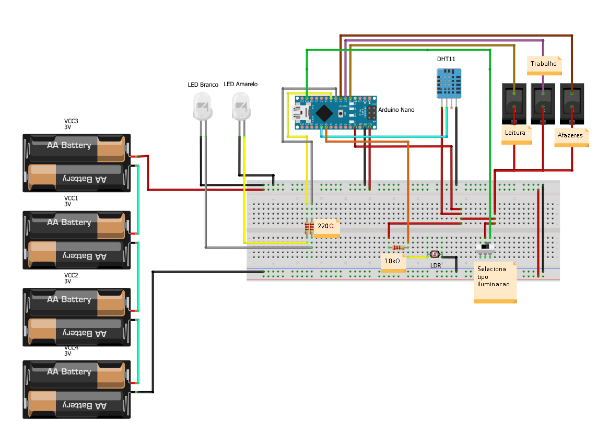

# extensaoIOT
Automação Residencial 
No projeto a pessoa podera escolher se quer que a iluminaçao seja autonoma ou não 
Assim como poderá escolher o tipo de iluminação, seja ela para Trabalho, Leitura ou Afazeres 
Ela também poderá verificar a temperatura e umidade do ambiente em tempo real 
 
No fritzing crie o circuito conforme a figura abaixo: 
 
 
Na programação em texto estruturado faça assim: 
<a href = "final_extensaoIOT.ino">Clique aqui para o código</a> 

Arquivo para biblioteca sensor de temperatura e umidade: 
<a href = "DHT-sensor-library-master.rar">Clique aqui para o arquivo</a> 

